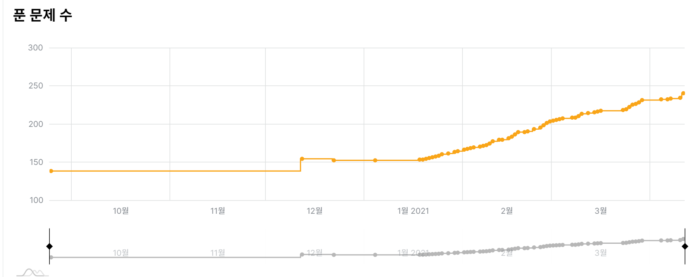

# 알고리즘 풀이 저장소

# 🔫 알고리즘을 위해 공부한 사이트 및 코드 들 모음

- 백준 : 브론즈~골드 사이 문제들을 풀었던 소스코드
- 프로그래머스 : 1~3레벨 까지의 문제들의 소스코드
- ICT : 학점연계형 실습을 위해 테스트를 보았던 문제들의 소스코드
- LINE 2021 : 상한기에 풀었던 코드
- swea : 삼성 기출 문제 및 d1~d6 까지의 레벨의 문제들의 소스코드

## 🍅 풀었던 알고리즘 종류

1. 완전 탐색 알고리즘 - 순열, 조합 ,부분 집합
2. 그리디 
3. 분할 정복
4. 이진 검색
5. 백트레킹
6. 그래프 이론 - bfs ,dfs , 플루이드 워샬, 다익스트라, 프림, 크루스칼 알고리즘
7. 문자열 패턴 알고리즘 - KMP
8. 동적 프로그래밍 
9. Stack & queue
10.  시물레이션 

하루에 한 문제씩 풀면서 1일 1커밋을 원칙으로 한다.
주말에는 free하게 올리기.

# 나의 실력 변화 체크

2021-01-15   백준 티어 기준 Sliver 1 

---

2021-02-15  백준 티어 기준 Gold 5

---

2021-04 -11 백준 티어 기준 Gold 2

